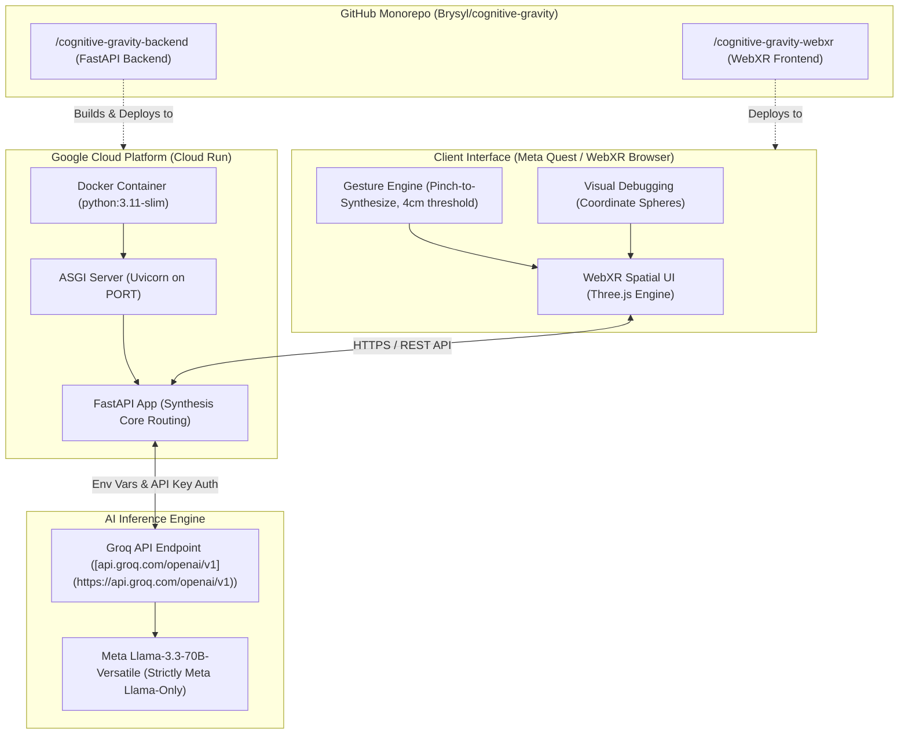

# 🪐 Cognitive Gravity: Agentic Volumetric Synthesizer

[](https://meta.com)
[](https://github.com/brysyl/cognitive-gravity/actions)
[](https://www.python.org)
[](https://immersiveweb.dev/)

**Cognitive Gravity** is an agentic volumetric synthesizer for a hands-first WebXR productivity space. It materializes abstract thoughts as kinetic 3D nodes, allows pinch-based interaction with tracked hands, and synthesizes collided concepts into higher-order knowledge using Meta Llama.

Designed specifically for the **Meta VR Start Developer Competition 2026**, this architecture is optimized for low-latency synthesis, zero-controller input, and tight spatial constraints.

---

## 🏆 Key Winning Attributes

* **Hands-First Mechanics:** 100% controller-free. Uses index-thumb pinch vectors to stretch nodes and reveal source metadata.
* **Agentic Synthesis Loop:** Physically grabbing and colliding two concept spheres triggers the backend AI agent to synthesize a hybrid knowledge node in real time.
* **Airplane Seat Optimized:** All volumetric nodes and UI panels spawn and remain within a strict 0.6-meter radius of the user's headset (0.4m forward, 0.1m down).
* **Instant "Bus Stop" Cold Start:** Bypasses login screens and heavy loading sequences, putting the user into a fully interactive spatial graph within 5 seconds.

## 🏗 Architecture & Stack

Cognitive Gravity operates on a unified, single-domain microservice architecture to eliminate WebXR CORS restrictions.

* **Frontend:** Vite, TypeScript, Three.js, WebXR-ready ECS (Entity-Component-System) pattern.
* **Physics Engine:** Custom gravity and soft-body collision logic tuned for a compact 0.6m workspace.
* **Backend:** FastAPI with robust WebSocket orchestration and exponential backoff.
* **AI Orchestration:** Meta Llama via HTTP API for semantic node synthesis.
* **Vector Memory:** Supabase (PostgreSQL + pgvector) for persistent spatial embeddings.
* **Infrastructure:** GitHub Actions CI/CD pipelines deploying to Vercel (Frontend) and Google Cloud Run (Backend).

---

---

## 📐 System Architecture Diagram


---

## 🚀 Local Development

### 1. Environment Setup
Clone the repository and configure your environment variables:
```bash
git clone [https://github.com/brysyl/cognitive-gravity.git](https://github.com/brysyl/cognitive-gravity.git)
cd cognitive-gravity
cp .env.example .env

Edit .env and add your META_MODEL_API_KEY and Supabase credentials.
2. Start the FastAPI Backend
Ensure you have Python 3.11+ installed.
cd backend
python -m venv venv
source venv/bin/activate  # On Windows use `venv\Scripts\activate`
pip install -r requirements.txt
uvicorn main:app --host 0.0.0.0 --port 8080 --reload

The WebSocket synthesis engine will now listen on ws://localhost:8080/ws/synthesis.
3. Start the WebXR Frontend
In a new terminal window:
cd frontend
npm install
npm run dev

Launch the provided local URL in a WebXR-compatible browser or the Meta XR Simulator.
🌍 CI/CD & Deployment
This repository utilizes headless deployments via GitHub Actions.
 * Frontend (Vercel): Triggered automatically on push to main. Deploys the Vite optimized build.
 * Backend (Google Cloud Run): Containerized via a multi-stage Alpine Dockerfile. Cloud Run handles automatic scaling and TLS termination for the FastAPI WebSocket engine.
# To trigger a manual backend deployment via CLI:
gh workflow run deploy-backend.yml

Engineered for the Meta VR Start Developer Competition 2026.
